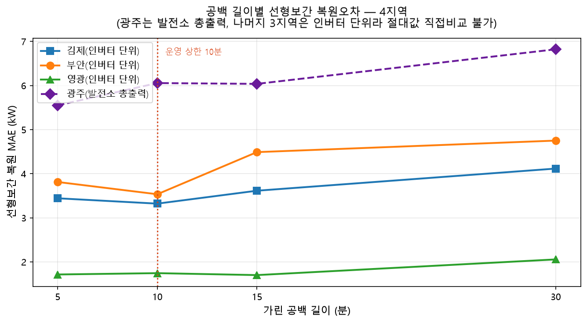

# UCUBE 태양광 발전량 예측 모델

> Evidence-first: 공개 가능한 실험 근거와 실제 운영·Shadow 관측을 구분합니다.

## 1. 프로젝트 개요

- **목적**: 광주·부안·김제·영광 4개 발전소의 초단기(+1~4h), 단기(+24h/+48h), 중장기(D+1 일간), 월간 발전량 예측
- **원칙**: 국내 학술·공공 근거를 우선하고, 직접 근거가 없거나 검증이 부족한 방법은 공식 모델로 승격하지 않습니다.

## 2. 현재 모델 상태 요약

| 수평 | 지역 | 상태 | 비고 |
|---|---|---|---|
| 초단기(+1~4h) | 4지역 | Shadow 관측 | 운영 공식 모델과 분리된 후보 검증 단계 |
| +24h pooled | 4지역 | 후보·Shadow 조립 | 정규 GRID/NWP 기반의 익일 시간구간 풀링 |
| +48h NC | 4지역 | 후보·Shadow 조립 | KIM NC(D+1/D+2) 기반; 부안 시험표본 24행, 광주도 공식 승격 보류 |
| D+1 일간 | 김제·영광 | 기존 재검증 기록 | 지속성 대비 개선 기록은 있으나 월간 모델 검증과는 별개 |
| 월간 | 광주·영광 | 탐색 후보·승격 보류 | GB-Huber; 계절 편향·기준선 비교를 추가 검증해야 함 |

상태의 뜻과 수평별 제한은 [종합 보고서](docs/REPORT.md), 최근 운영 변경은 [2026-09-16 기록](docs/DAILY_2026-09-16.md)에서 확인합니다.

## 3. 주요 방법과 학술 근거 수준

| 방법 | 국내 직접 근거 | 근거 수준 | 판단 |
|---|---|---|---|
| 계절 분류 | 김백천 외(2021) | 중 | 분류 원칙 채택 |
| 기상예보 + 발전량 lag | 김정원(2019) 등 | 중~강 | 채택 |
| 상관 변수선정 | 박건하·김종찬(2025) | 중 | 방향 채택, 임계값은 프로젝트 실증 |
| 다중 리드타임 풀링 | 박재민 외(2023)의 원리 | 원리 중 / 구현 약 | 자체 실험 |
| 선형보간 10분·VIF 기준 | 직접 근거 없음 | 없음 | 자체 실증 결과로만 유지 |
| GB-Huber 월간 | 직접 근거 없음 | 없음 | 공식 승격 보류 |

상세 논문 대조와 방법별 한계는 [종합 보고서](docs/REPORT.md)의 학술근거·변수선택 절에 보관합니다.

## 4. 데이터 및 전처리 요약

- **발전량**: Blockdata 인버터 실측; 품질상태 pass-through와 동료 대조
- **기상**: ASOS 관측 + KMA GRID/NWP + KIM NC(D+1/D+2)
- **결측·이상치**: 물리 범위와 동료 대조를 사용하며, IQR 일괄 추가는 채택하지 않음
- **보간**: 선형보간, 최대 10분. 문헌 규정이 아니라 프로젝트 내 복원오차 실증 기준

## 5. 검증 방식

- walk-forward / expanding window
- 기상학적 4계절 구분과 fold 내부 climatology 기준선
- 지속성·계절평균 기준선 대비 개선율 보고
- 학습·검증 표본 수와 독립일수 게이트를 분리해 표시
- 번들 저장·오프라인 성능·입력 조립 성공·Shadow 관측을 같은 의미로 취급하지 않음

## 6. 결과·학술근거 스냅샷

아래 그림은 설명용 도식이 아니라 프로젝트의 실제 평가 산출물입니다. 논문은 **방법 선택의 방향**을 뒷받침하고, 그림은 **이 프로젝트 데이터에서의 결과**를 보입니다. 그림별 원본 경로와 SHA-256은 [그림 출처 목록](docs/figure_provenance.json)에서 추적할 수 있습니다.

| 4지역 결측 보간 복원오차 | 다지역 VIF·쌍상관 정책별 MAE |
|---|---|
|  |  |
| **해석**: 지역별 공백 길이에 따른 실제 복원오차로 보간 상한을 점검합니다. | **해석**: 변수선택 임계값은 문헌의 직접 규정이 아니라 동일조건 MAE 비교로 판단합니다. |

| 광주 월간 OOF: 실측·예측 | 영광 월간 OOF: 실측·예측 |
|---|---|
|  |  |
| **해석**: 전체 평균 오차만으로 승격하지 않고 계절별 실패 여부를 함께 확인합니다. | **해석**: 가장 단순한 기준선과의 비교가 끝나기 전까지 GB-Huber는 후보입니다. |

계절별 성능 분해는 [광주](figures/monthly_gwangju_season.png)와 [영광](figures/monthly_yeonggwang_season.png) 그림을, 학술근거·변수선택의 전체 설명은 [종합 보고서](docs/REPORT.md)를 참조합니다.

## 7. 폴더 구조

```text
code/       데이터수집·전처리·모델학습·평가검증 코드(원래 경로 보존)
docs/       지역별 문서, 학술근거, 실험·운영 변경 기록
figures/    출처가 기록된 검증 그림
results/    공개 가능한 OOF·지표·감사 매니페스트
scripts/    공개 결과 재계산·렌더링 스크립트
```

## 8. 한계 및 미해결 항목

- 부안 +48h는 시험표본이 24행으로 계절 안정성을 판단할 수 없음
- 광주 +48h도 후보 단계이며 실제 입력·수신시각·독립일수 검증이 더 필요
- 월간 GB-Huber는 광주·영광 모두 계절별 편향이 있어 승격 보류
- 보간 시간·VIF 임계값은 국내 문헌의 직접 규정이 아니라 자체 실증 결과
- 해외 연구는 구체 인용 없이 관행 참고 수준으로만 사용

## 9. 재현 및 라이선스

공개된 월간 OOF 결과와 근거 그림은 아래 명령으로 다시 생성할 수 있습니다.

```bash
python scripts/render_monthly_evidence.py
```

원시 발전소 DB·Excel·NC, API 키, 운영 로그, 모델 바이너리와 운영 스케줄러는 공개하지 않습니다. 공개 코드·데이터·그림의 이용 범위는 저장소 소유자와 UCUBE 기관 정책을 따릅니다.
