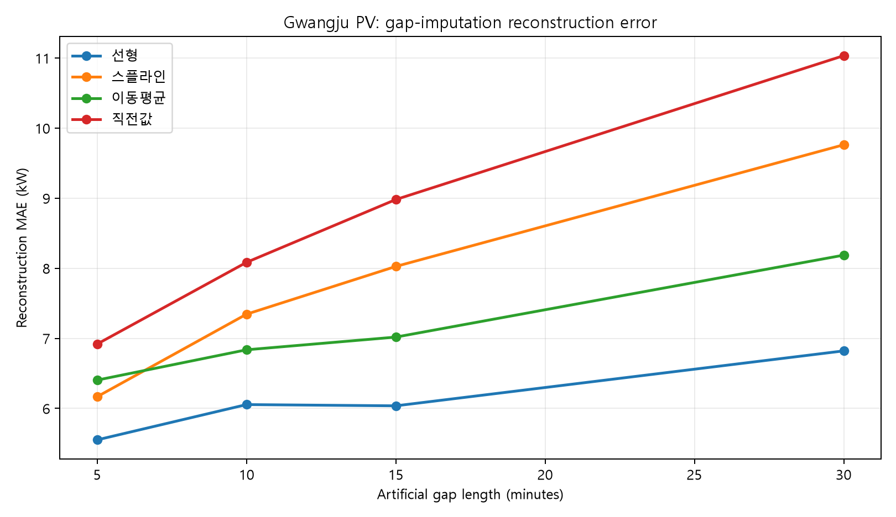
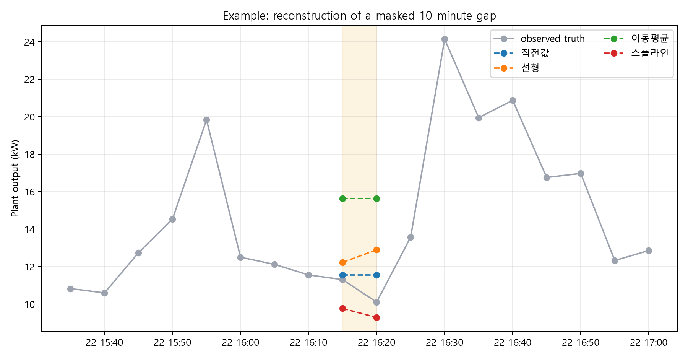
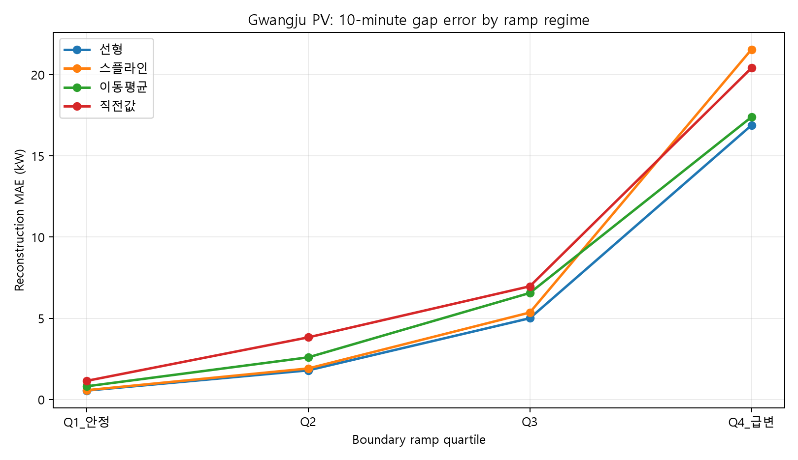
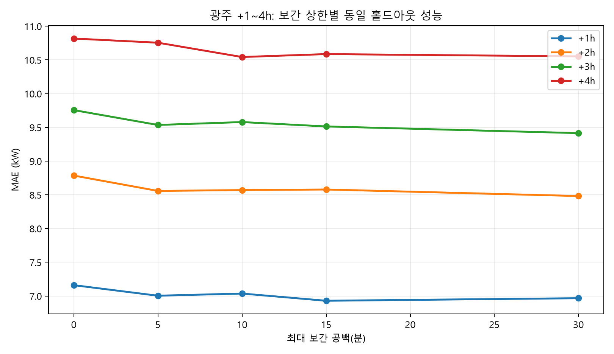
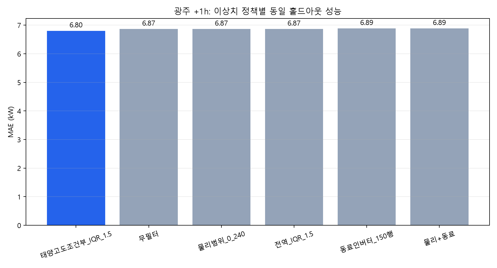
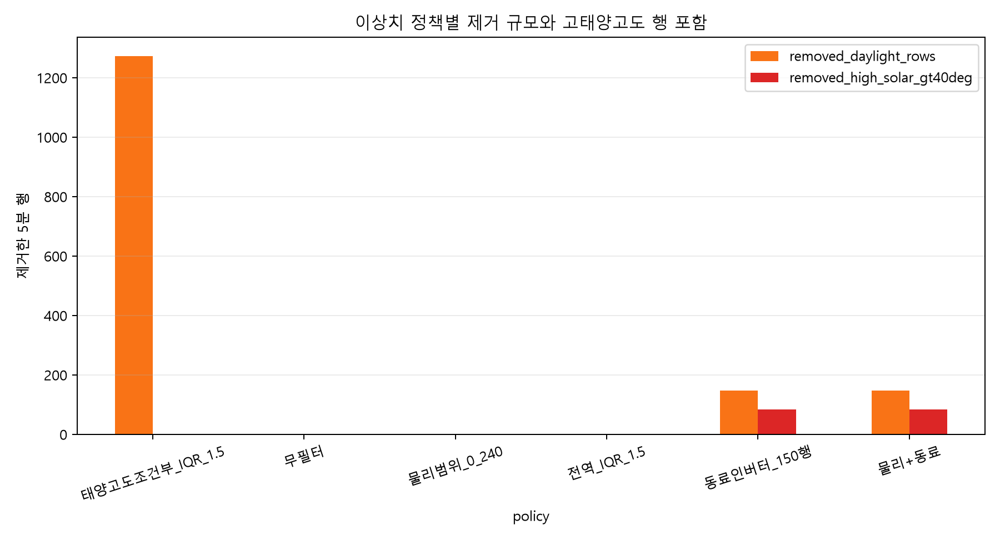
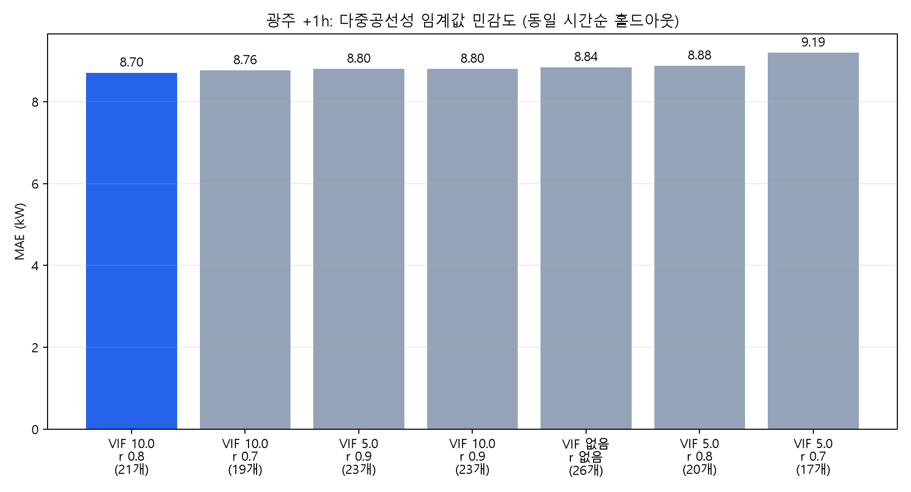
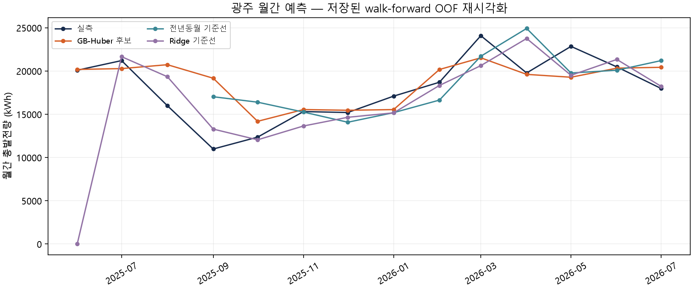
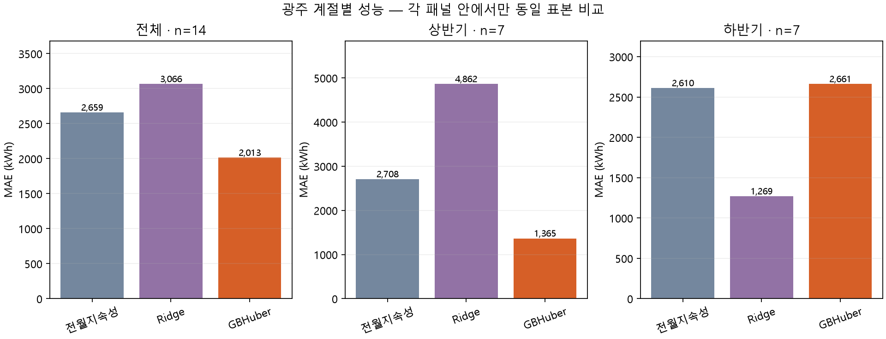

# 4지역 태양광 예측 — Notion·PPT 근거 정리

기준: 2026-09-10에 읽은 AGENTS 기록, 실제 평가 보고서, 후보 번들 감사 JSON, 월간 OOF·manifest. 아래 숫자는 해당 실험 시점의 고정 결과이지 실시간 대시보드 상태가 아닙니다. 이번 정리는 기존 실험을 대조하고 월간 저장 예측의 지표·그림을 재계산한 작업입니다. 모든 모델을 새로 재학습했다는 뜻이 아닙니다.

## 1. 핵심 결론과 읽는 순서

전처리의 이유 → 실제 비교 그림 → 동일조건 성능 → 선택·보류 이유 → 운영 한계 순서로 읽습니다. PPT에서는 각 절을 1~2장으로 나누고 그림을 해당 설명 바로 옆에 둡니다.

- 선형보간은 짧은 공백의 비교에서 유리했지만, 10분 상한은 국내 논문이 보장한 절대 기준이 아닙니다.
- VIF·상관계수는 진단 근거입니다. 트리 모델에서도 임계값대로 무조건 제거하면 유리하다는 결과는 아닙니다.
- 모델 번들 저장, 오프라인 성능, 입력 조립 성공, Shadow 운영 통과는 서로 다른 단계입니다.
- 광주·영광 월간 GB-Huber는 전체 평균만 보면 좋지만 계절별·기준선별 약점이 있어 공식 승격 보류입니다.

## 2. 자료 계보와 수집 한계

| 자료 | 실제 역할 | 확인해야 하는 한계 |
|---|---|---|
| Blockdata·과거 Excel | 인버터/발전소 실측 출력과 이력 | 시간슬롯 공백, 용량 차이, 통신 이상, 누적계량기 리셋 |
| ASOS | 발행시점 이전 관측 기상·과거 환경 | 지점별 제공 항목 차이, 지연, 일사 관측 불가 지점, 강수 결측의 의미 |
| GRID | 발표된 격자예보 | 발표시각과 대상시각, 실제 수신시각을 구분 |
| NWP 산업특화·KIM NC | 예측 대상 시각의 일사·운량 | 경로별 가용기간·변수 단위·수신이력·과거 호환성 |
| GK2A 위성 | 향후 활용 후보 이력 | 수집했다는 것과 모델에 채택했다는 것은 다름 |
| 설비대장·등록정보 | 용량/방향/각도 등 메타데이터 | 등록값과 검증된 명판값·학습 분모를 혼동하지 않음 |

국내 4개 발전소를 같은 정책으로 평가하되, 같은 데이터가 모두 존재한다고 가정하지 않습니다. 과거 자료가 충분한 영광도 라이브 수집은 늦게 시작해 lag 이력이 부족할 수 있습니다. 반대로 최근 라이브 결측률이 높다고 과거 710일 archive까지 없다고 판단하면 안 됩니다.

광주 용량은 발전소 등록 240kW, 인버터 등록 합계 219kW, 모델 기준 219kW를 분리해 관리한 기록이 있습니다. 각 결과의 실제 분모를 manifest에서 확인하며, 숫자를 하나로 임의 통합하지 않습니다. 후속 설비정보가 확보돼도 정격 검증 완료와 동의어가 아닙니다.

### 제출용 초안에서 수정·제외한 주장

| 초안 표현 | 처리 이유와 정정 |
|---|---|
| 지역별 결측률 12.4/8.7/15.1/6.3% | 분모·기간·실측 산출물 미확인. 공식 숫자로 채택하지 않음 |
| 김제·영광 5~6개월 자료만 확보 | 710일 과거 archive 확인과 충돌. 라이브·과거 기간을 분리 |
| 기압 326.3도 | 단위 자체가 잘못됨. 풍향인지 원천 컬럼 재확인 전 사용 금지 |
| 모든 지역 초상온도 710일 결측 0 | 지역별 파일 검증 근거 없으므로 미확인 |
| STL 2.5σ·전이학습·IDW·특성 가중치 강화 적용 | 실행 코드·결과 연결 미확인. 구현 사실로 쓰지 않음 |
| TimescaleDB/MySQL·KASI·DEM 자동 연동 확정 | 확인한 SQLite/CSV 기반 경로와 구분. 명시된 임의 파일명을 증거로 사용하지 않음 |
| 24개 변수 모두 수집·활용 | 환경 항목 자체의 개수도 일치하지 않음. 수집/파생/제외/미확인과 모델 사용을 별도 관리 |

이 초안은 보고서 문장 구성 참고자료이지 사실의 우선 출처가 아닙니다.

## 3. 결측 보간 — 왜 선형이며 왜 제한하는가

양쪽 정상 관측 사이의 짧은 공백에서는 선형 연결이 단순하고, 자연 3차 스플라인처럼 관측 범위를 벗어나는 굴곡을 만들지 않습니다. 그러나 구름에 의한 급변·설비 정지에서는 실제 출력이 연속적으로 부드럽다는 가정이 깨질 수 있습니다. 그래서 긴 공백을 복원값으로 덮지 않고 NaN으로 유지하고, 원관측/보간/통신결측의 품질상태를 구분합니다.

국내 정하영 외(2021)의 [태양광 발전량 데이터의 시계열 모델 적용을 위한 결측치 보간 방법 연구](https://www.dbpia.co.kr/journal/articleDetail?nodeId=NODE10612135)는 공개 초록에서 SMA와 Kalman 비교를 다룹니다. 이 연구가 선형보간 10분 상한을 규정한 것은 아닙니다. 본 프로젝트의 선형·스플라인·이전값·주변평균 비교는 별도 실험입니다. **Kalman을 아직 같은 조건으로 비교하지 않았으므로 해당 논문의 직접 재현이라고 말하지 않습니다.** 공개 초록을 확인했으며 논문 전체 실험 세부 재현은 미완료입니다.

### 실험 설계

연속된 정상 주간 5분 관측에서 1/2/3/6슬롯을 인위적으로 가리고, 실제 숨긴 값과 복원값을 비교했습니다. 공백길이별 500개, seed=42입니다. 양쪽 경계가 필요한 보간은 사후 정제에 해당합니다. 라이브 예측에서는 오른쪽 관측값이 발행시각 뒤에 있으면 사용할 수 없습니다.

광주 선형 MAE는 5/10/15/30분에서 5.551/6.055/6.037/6.821kW입니다. 자연 스플라인은 6.168/7.344/8.026/9.762kW이며, 비교 실험의 0~240kW 물리 범위 위반도 6/11/31/76건 발생했습니다. 선형은 이 실험에서 범위 위반 0건입니다. 이 물리 상한은 해당 실험 기준이지 모든 인버터에 적용할 공통 상한이 아닙니다.

이 그림은 방법 설명용 가상 곡선이 아니라 실제 관측을 마스킹한 비교 사례입니다. 사례 하나만으로 우열을 판단하지 않고 위 반복 표본 결과와 함께 봅니다.

10분 공백 선형 MAE도 출력변화가 작은 Q1에서 0.546kW, 큰 Q4에서 16.878kW로 달라집니다. 따라서 ‘10분이면 안전하게 진짜 발전량을 알 수 있다’가 아니라 ‘짧은 구간에 제한된 추정이며 급변시 오차가 커진다’가 정확합니다.

### 보간 상한과 모델 성능은 별도로 평가

| 허용 공백 | 복원된 5분 셀 | 학습행 | 공통 시험 MAE(kW) |
|---|---:|---:|---:|
| 보간 없음 | 0 | 7,300 | 7.160 |
| 5분 | 11,594 | 8,264 | 7.004 |
| 10분 | 17,731 | 8,332 | 7.036 |
| 15분 | 19,257 | 8,356 | 6.929 |
| 30분 | 21,433 | 8,370 | 6.967 |

위 표는 광주 +1h의 공통 원관측 시험 1,309행입니다. 복원 셀 수는 데이터프레임 전체 행 수가 늘었다는 뜻이 아닙니다. +1h에서는 15분, +2h/+3h에서는 30분, +4h에서는 10분 후보가 가장 낮은 MAE였습니다. 단일 수평의 최적값을 모든 수평에 적용하지 않습니다. 현재 10분은 결측 복원량과 왜곡 위험을 절충한 운영정책이며, 모든 수평 최적이라고 주장하지 않습니다.

10분 선형 MAE는 부안 3.534, 김제 3.321, 영광 1.744kW입니다. 이 실험은 인버터 단위이며 광주 발전소 총출력 실험과 스케일이 다릅니다. 숫자가 작다는 이유로 영광 모델이 가장 좋다고 해석하지 않습니다.

## 4. 이상치와 통신오류 — 제거 기준의 근거

하한·상한은 센서 종류와 단위, 발전소/인버터 용량을 확인한 뒤 적용합니다. 통신 플래그만으로 야간의 실제 0을 결측으로 만들거나, 통신결측을 실제 발전 0으로 학습시키지 않습니다. 동료 인버터는 같은 시각의 용량차와 일사 조건을 고려한 보조 증거입니다.

광주 +1h 공통 1,309행: 물리 범위 정책 MAE6.865kW, 태양고도 조건부 IQR6.802, 동료대조6.887입니다. 조건부 IQR은 1,272행을 제외했지만 오차차이의 제시된 부트스트랩 구간이 0을 포함합니다. 동료대조도 유의한 성능 향상을 입증하지 못했습니다. **품질관리의 타당성과 예측오차 개선을 같은 주장으로 묶지 않습니다.**

물리 범위 추가 제외가 0건인 이유는 상류에서 정제한 데이터가 입력이기 때문일 수 있습니다. 원본 데이터가 완벽하다는 증거가 아닙니다. 시계열 의존성을 고려한 블록 단위 불확실성 검증은 후속 과제입니다.

## 5. 상관·다중공선성 — 진단과 선택 분리

상관은 연관성이지 인과성이 아닙니다. VIF는 선형 중복 진단입니다. 시간순 검증의 학습 구간 안에서만 계산·선택하고, 미래 시험 기간을 보고 특성을 고르지 않아야 합니다.

광주 +1h 동일 홀드아웃 421행에서 VIF10/쌍상관0.8은 21개 특성·MAE8.704kW, 미제거는 26개·8.839kW였습니다. 이 결과만으로 다른 지역과 모든 수평의 자동 제거를 정당화할 수 없습니다.

부안은 미제거 60.382 vs10/0.8 60.678kW, 김제는5/0.7 46.587 vs10/0.8 47.301kW, 영광은 미제거30.947 vs10/0.8 31.863kW입니다. 따라서 지역별 모델에 같은 진단 절차를 적용하되 선택 결과까지 강제로 같게 만들지 않습니다. 임계값 선택에 재사용한 시험셋은 독립 최종검증셋으로 다시 부르지 않습니다.

## 6. 모델과 시간순 검증

[국내 DNN–RNN 비교연구](https://journal.kci.go.kr/kiots/archive/articleView?artiId=ART002855199)는 국내 모델 비교의 관련 연구로 참조합니다. 프로젝트의 XGBoost/LightGBM/GB-Huber 구조 및 수치가 그 연구의 재현 결과라는 의미는 아닙니다. 프로젝트별 walk-forward 기간·수평·특성은 실제 코드와 manifest를 기준으로 적습니다.

예측 시각 t의 입력은 실제로 t까지 수신한 관측·예보여야 합니다. 예보의 모델런, 대상시각, 최초 유효 수신시각, 나중 재수신시각을 분리합니다. `first_received_at`이 일찍 찍혀도 나중에 값이 변경됐다면 현재 값을 과거에 사용할 수 있었다는 증거가 아닙니다. 값 버전별 이력 또는 당시 스냅샷이 필요합니다.

불연속 기간은 연속 시간 인덱스의 NaN으로 유지하고 segment별 lag/rolling을 계산합니다. 광주의 505시간 공백은 보간하지 않았습니다. 미래 타깃이 학습/시험 경계를 넘는 행도 제외합니다. `max_target_relative_lag_used=0` 같은 단일 플래그만으로 수신시각·전처리·특성선정까지 모든 누출이 없다고 단정하지 않습니다.

### 09.10 단기 후보 파일 감사

| 지역 | 라벨 | 모델 | 특성 | 학습행 | 시험행 | MAE(kW) | RMSE(kW) |
|---|---|---|---:|---:|---:|---:|---:|
| 광주 | +24h | LightGBM | 26 | 122,205 | 7,153 | 11.492 | 17.750 |
| 부안 | +24h | XGBoost | 21 | 1,405 | 797 | 57.834 | 111.372 |
| 김제 | +24h | XGBoost | 24 | 5,159 | 3,362 | 46.979 | 92.447 |
| 영광 | +24h | XGBoost | 23 | 5,583 | 3,735 | 31.325 | 62.064 |
| 부안 | +48h | LightGBM | 26 | 207 | 24 | 33.461 | 49.612 |
| 김제 | +48h | LightGBM | 30 | 1,350 | 904 | 58.261 | 103.505 |
| 영광 | +48h | XGBoost | 32 | 1,399 | 943 | 31.822 | 60.889 |

근거: `단기후보_오프라인감사_2026-09-10/감사결과.json`에 저장된 manifest 수치. 학습행은 고유 달력시간 수로 해석하지 않습니다. 광주 +48h 후보는 이 감사에 없습니다. 부안 +48h는 시험 24행으로 매우 작습니다. 서로 다른 표본의 +24h와 +48h MAE를 비교해 ‘+48h가 더 정확’이라고 말하지 않습니다.

이번 파일 감사의 PASS는 로딩·스키마·해시·시험 추론의 범위입니다. 전체 시간 누출 감사를 새로 통과했다거나 공식 모델 승격을 의미하지 않습니다. 별도 Shadow 결과와 구분합니다.

## 7. 월간 예측 — 전체 평균에 가려진 실패

이번 정리에서 저장된 OOF CSV를 직접 읽어 지표를 재계산하고 아래 그래프를 생성했습니다. 재현 코드는 `scripts/render_monthly_evidence.py`, 입력은 `results/monthly_*_oof.csv`입니다. WAPE=Σ|오차|/Σ|실측|×100, MAE=평균절대오차, RMSE=제곱평균제곱근오차입니다. 월간 단위는 kWh이며 시간별 출력 kW와 섞지 않습니다.

광주 전체14개월 GB-Huber WAPE11.18%, MAE2,012.9kWh, RMSE2,972.6kWh입니다. 계절평균 기준선 WAPE14.42%보다 낫지만 하반기7개월 MAE는 GB-Huber2,661.0, Ridge1,269.4, 전월지속성2,610.5kWh입니다. **‘최고 기준선27.1%’는 기존 요약의 오류**이며27.1%는 선형회귀의 WAPE입니다. 전체 평균 우위가 계절 안정성을 보장하지 않습니다.

영광은 전년동월이 존재하는 동일11개월로 비교해야 합니다. 전년동월 WAPE10.89%·MAE7,556.8·RMSE8,842.2kWh, GB-Huber12.64%·8,764.8·11,001.5kWh입니다. 세 지표 모두 기준선에 졌습니다. 전체14개월 GB-Huber WAPE10.99%를11개월 전년동월과 직접 비교하면 불공정합니다.

**선택 이유와 보류 조건:** Huber 손실은 큰 잔차의 영향을 완화하려는 탐색 가설이지만, 국내 월간 태양광에 대한 직접 채택 근거는 이번 조사에서 확인하지 못했습니다. ‘국내 연구가 없다’는 단정도 하지 않습니다. 계절별 재검증·용량변경월·완결월 수 확충 후 같은 표본의 단순 기준선을 반복적으로 이겨야 승격을 논의합니다. 현재 광주·영광 모두 탐색 후보 유지입니다.

## 8. 초단기·Shadow와 수집 장애

초단기 +1~4h와 단기 +24h/+48h는 입력과 로그·게이트를 분리합니다. NWP가 없다고 모든 초단기 모델이 멈춘다고 표시하면 안 됩니다. 실제 manifest의 필수 입력을 기준으로 ASOS 신선도, 발전 lag, GRID, NWP 각각의 대기 사유를 기록합니다.

09.10 기록에서는 ASOS08:00·GRID00시대 정체와 API 연결 장애가 확인됐고 수집 재시도·실행시간을 제한했습니다. 이는 수집 복구 완료가 아니라 장애가 다른 작업까지 붙잡지 않게 하는 대응입니다. 과거 NC 학습 완료도 미래 라이브 입력 정상화를 뜻하지 않습니다.

게이트에는 원시 예약실행률·예측생성률을 보존하고, 장애를 제외한 조건부 수치는 보조 지표로 따로 표시합니다. 여러 지역 ASOS가 오래됐다는 휴리스틱만으로 장애 기간이 확정된 것은 아닙니다. 화면 ‘보류’ 표시와 게이트 시계 실제 정지/재시작도 다릅니다. 04:30~20:30 실행시간 변경 기록이 있으므로 기대 슬롯 분모와 제외기간의 정식 정책 재확인이 필요합니다.

## 9. 후속 우선순위와 완료 판정

1. 데이터 수집 복구: 마지막 시도와 마지막 유효 수신을 분리, 다음 실행·지연 마감시각 표시.
2. 발행시각 안전: 당시 수신된 값 버전으로 재구성. 늦게 받은 것을 이른 예측에 소급 사용하지 않음.
3. Shadow: 4지역·수평별 입력 완결성, 실제 예측행, 평가 가능한 미래 실측 쌍을 확인.
4. 표본 부족: 부안 +48h, 영광 결함기간 미감사, 광주 +48h 부족을 별도 보류.
5. 월간: 기준선·계절·부분가용 용량월 재검증. 분기·연간 단순집계를 예측모델 성능으로 부르지 않음.
6. 논문: 국내 원문 세부 조건과 Kalman 등 미비교 방법 검토. 프로젝트 임계값을 학술 정답으로 소급하지 않음.

## 10. 출처 추적과 재현 범위

- 09.09 국내학술근거 방법론 종합보고서 및 비교 스크립트: `code/04_평가검증/`.
- 09.10 월간 비교: `code/03_모델학습/현재_종합파이프라인/compare_monthly_baseline_candidates_v1_2026-09-10.py`.
- 단기 학습/조립/감사: 해당 단계별 코드와 후보 manifest. 공개본은 원시 DB/모델 바이너리를 제외.
- 그림별 원본 경로·해시: `docs/figure_provenance.json`. 월간 신규그림은 공개 OOF로 재생성 가능.
- 국내 문헌은 위 원문 링크의 공개 초록·서지 확인 범위로 인용. 수치를 다른 연구의 수치와 혼합하지 않음.

보관된 실험 그림은 원본을 재사용했고, 이번 실행에서 모든 보간·공선성 실험을 다시 학습한 것은 아닙니다. PPT에는 각 그림에 ‘실험일/입력/대상/평가지표/표본/후보 상태’를 남기십시오.

## 11. 종합보고서 후속 수정 요구사항 — 09.11 사용자 피드백

현재 보고서는 보간과 누출 방지 설명에 비해 **변수 계보·지역별 비교·표 형태의 지표·이상치 시각화**가 부족하다. 다음 개정 때 아래 순서를 고정한다.

### 11.1 원자료에서 최종 변수까지의 계보를 먼저 제시

인버터 원본 Excel만 있던 출발점에서 발전량·인버터 상태를 정제한 뒤, ASOS 관측·NWP/GRID 예보·시간/달력·태양 위치·발전량 lag/rolling을 어떤 근거로 추가했는지 표로 만든다. 각 변수마다 `원자료 → 전처리/집계 → 분석 단계 → 최종 채택 여부 → 라이브 재현 가능 여부`를 기록한다.

### 11.2 상관분석과 다중공선성의 전후를 분리

상관분석에 투입한 전체 후보변수와 타깃, Pearson/Spearman 선택 이유, 결측 처리와 표본 수를 먼저 밝힌다. 그 다음 VIF·쌍상관 기준, 제거된 변수, 제거 후 남은 변수, 기준 적용 전후 성능을 분리해 제시한다. ‘처음부터 선택된 변수’처럼 보이게 축약하지 않는다.

### 11.3 지역별 설명 순서를 통일

모든 분석 장을 `광주 → 부안 → 김제 → 영광` 순으로 반복한다. 광주만 상세히 설명한 뒤 3개 지역 수치를 뒤에 일괄 배치하지 않는다. 각 지역마다 원자료, 후보변수, 상관히트맵, 다중공선성 결과, 모델 성능표, 한계와 채택상태를 같은 소제목으로 맞춘다.

### 11.4 그래프 기준점과 배치를 재설계

그래프는 화면 상단에 몰아 배치하지 말고 해당 설명 직후에 둔다. 모든 축에는 단위·기간·지역·모델버전·표본 수를 표시한다. 지역 비교 그래프는 동일 축·동일 지표를 사용하며 광주/부안/김제/영광 순서를 유지한다. 그래프가 실제 산출물인지 예시 도식인지 캡션에서 구분한다.

### 11.5 복사 가능한 표 산출물 추가

Notion 본문 표만 사용하지 않고, 상관분석 히트맵 원자료, ME, MAE, MPE, MAPE, MSE, RMSE 표를 CSV/XLSX로 함께 제공한다. 표에는 지역·수평·모델·평가기간·주간/전체 조건·표본 수·단위·분모를 포함한다. 보고서에는 동일 표를 복사 가능한 Markdown/HTML 표로도 배치한다.

### 11.6 보간 그래프를 실제 사용 방법과 일치

현재 그래프가 실제 파이프라인의 선형보간/최근접 또는 broadcast 방식을 정확히 반영하는지 재확인한다. 사용자 참고 도식처럼 관측점, 보간점, 구간별 곡선을 표시하되, 실제 적용하지 않은 스플라인을 적용한 것처럼 그리지 않는다. 방법별 비교가 필요하면 선형·스플라인·최근접/broadcast를 동일한 공백·동일 표본으로 비교하고 행 수와 모델 성능 변화를 함께 표기한다.

### 11.7 상한·하한 기준 이상치 분석을 관리도 형태로 재작성

상한(UCL)·하한(LCL) 산정식과 기준 데이터 구간을 먼저 명시하고, 정상선·UCL·LCL·이상치 점을 같은 그래프에 표시한다. 단순 임계값을 임의로 그리지 않는다. 지역별·변수별 이상치 수, 제외/복원 행 수, 학습 전후 성능 변화와 대표 사례를 표로 함께 제공한다.

### 11.8 개정 완료 기준

- 원자료에서 최종 변수까지의 계보표가 존재한다.
- 광주·부안·김제·영광이 같은 목차와 같은 순서로 설명된다.
- 상관히트맵과 ME/MAE/MPE/MAPE/MSE/RMSE 표를 XLSX/CSV로 재사용할 수 있다.
- 보간 그래프가 실제 구현법과 일치하고, 방법별 성능·행 수가 함께 제시된다.
- UCL/LCL 이상치 그래프와 산정식·영향표가 존재한다.
- 모든 수치와 그래프에 출처 파일, 실행일, 평가조건, 표본 수가 연결된다.
