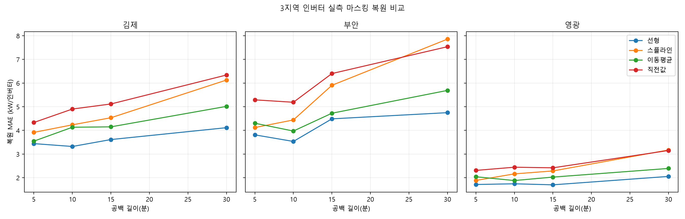
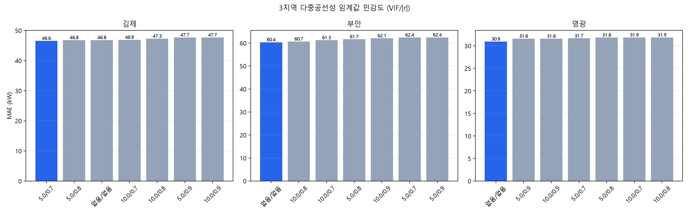
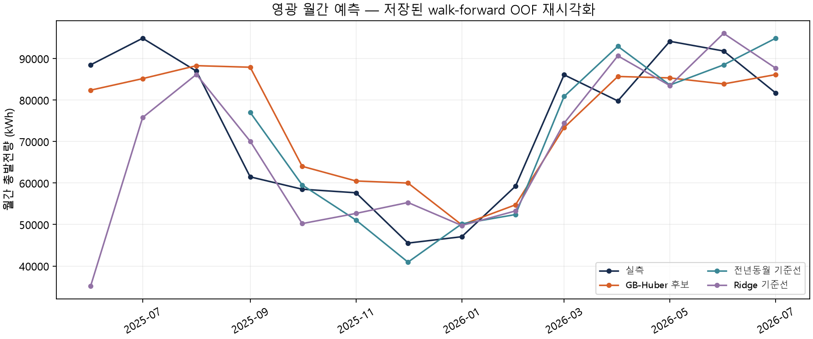
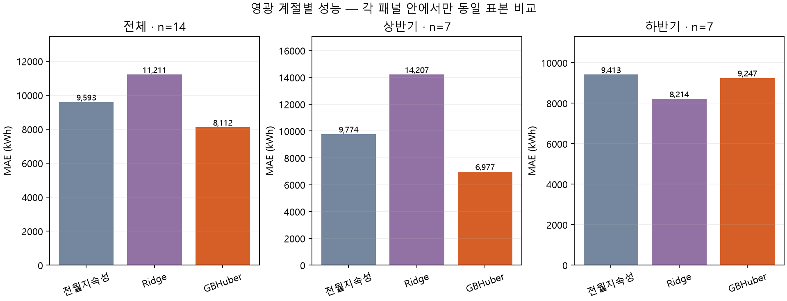

# 영광 — 2026-09-10 근거 정리

## 자료는 충분하지만 감사·라이브는 별개

과거 결합자료710일·5,680행, 발전량5,669행 유효(99.8%), 해당 archive NWP5종·GRID3종 결측0으로 확인된 기록입니다. 반면 라이브 수집은09-08 시작이라 최근2주 슬롯 공백률93.3%였습니다. ‘영광은 archive가 없다’는 이전 추측은 취소합니다.

`is_defect_period=False`가 전 행에 있어도 결함 없음이 증명된 것은 아닙니다. **defect_audit: 미실시**를 유지하고 공식 승격 전에 인버터 이력감사가 필요합니다.13대의 용량 차이도 동료대조에 반영해야 합니다.

## 전처리 검증

영광10분 선형 마스킹 복원 MAE1.744kW. 낮은 숫자는 인버터 용량·출력 스케일 차이를 포함하므로 지역 간 모델 우열의 근거가 아닙니다. 태양고도5도 이하라는 이유만으로 실제0을 확정하지 않고 낮은 고도에서의 피어 발전·플래그·원천값도 함께 확인해야 합니다.

미제거 MAE30.947kW가 VIF10/상관0.8의31.863보다 낮았습니다. 공선성 진단과 트리모델의 자동 변수삭제는 같은 정책이 아닙니다.

## 단기·일간

| 라벨 | 모델·특성 | 학습/시험행 | MAE/RMSE(kW) |
|---|---|---|---|
| +24h | XGBoost·23 | 5,583 / 3,735 | 31.325 / 62.064 |
| +48h | XGBoost·32 | 1,399 / 943 | 31.822 / 60.889 |

09.10 후보 감사 수치입니다. 결함감사·실제 입력·수신시각 검증과 운영 연결은 별개입니다. 일간총량 기존 재검증 기록은 지속성 대비57.49875% 개선이며 월간 모델 성능을 뜻하지 않습니다.

## 월간 — 가장 단순한 기준선에 패배

동일11개월에서 전년동월 WAPE10.89%·MAE7,556.8·RMSE8,842.2kWh, GB-Huber12.64%·8,764.8·11,001.5kWh입니다. 모든 지표에서 단순 기준선보다 나빠 복잡한 모델을 공식화할 실익이 입증되지 않았습니다. 후보 보존·승격 보류이며 기존 운영모델을 바꾸지 않습니다.

## 수신시각 설명

09-09 13:17 수신은 그 실행에서 확보한 시각입니다. 한 번의09시 결측과13시 성공만으로 ‘영광은 지리적으로 항상 예보가 늦게 발표된다’고 단정할 수 없습니다. 경로·모델런·폴링 시각·값 버전 차이를 통제해야 합니다. 화면은 ‘기준시각 이후 수신 — 해당 발행분 사용 불가’로 설명하고 발행시각 변경은 여러 날 관측 후 결정합니다.

국내 문헌·출처·공통 승격 조건: [종합](REPORT.md).

## 4계절 기준선 재검증

실제 목표월 기준의 폴드 내부 climatology 대비 MAE 개선율은 봄 67.73%, 여름 56.96%, 가을 60.33%, 겨울 64.11%입니다. 모든 계절의 독립일수가 충분하며, `defect_audit: 미실시`와 공식 승격 보류 상태는 그대로 유지합니다.
